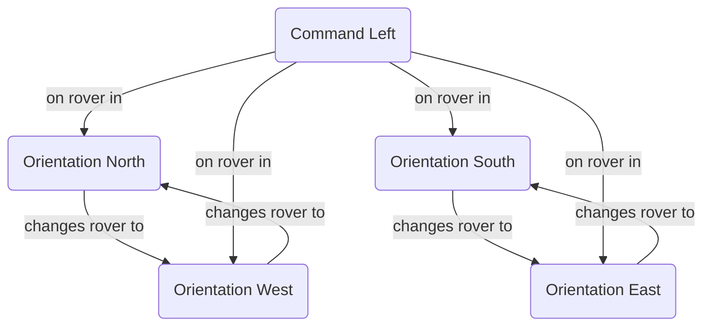
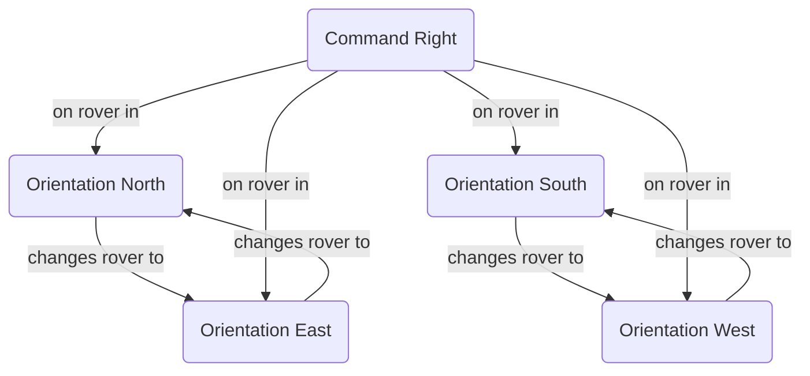
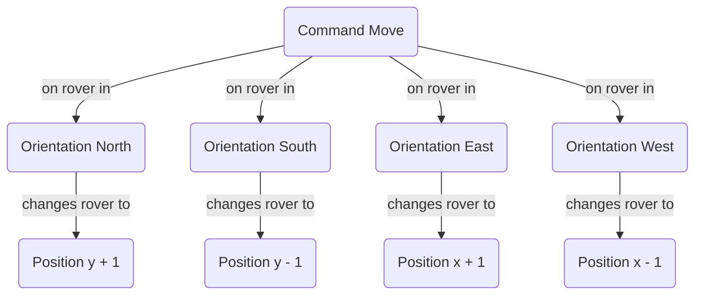

## Nasa Rover Monitor

Monitor and control the squad of rovers landed by NASA on a plateau in planet Mars.

An amazing adventure! 

I hope you enjoy!

### Test it

Clone this repository and execute above commands:

```
npm install
npm test
```

### Watch it

Clone this repository and execute above commands:

```
npm install
npm run watch
```

### Importing text file

To import text file execute `app/start` script passing path to file commands.

```
npm install
node app/start ./import-data-test.txt
```

> It uses the text file for testing, this is located into project [here](./import-data-test.txt).

### Solution

The plateau representation in planet Mars is coordinates by:

- Bottom left: `x=0` e `y=0` coordinates.
- Upper right: Is a custom one coordinates.

The rover position is the cartesian coordinates:

- `x`: The horizontal 2D coordinate.
- `y`: The vertical 2D coordinate.

The rover orientation is the cardinal orientation:

- `N`: The north orientation.
- `S`: The south orientation.
- `E`: The east orientation.
- `W`: The west orientation.


The rover commands is:

- `L`: Turn left 90 degrees.
- `R`: Turn right 90 degrees.
- `M`: Move forward from rover orientation.

The table below represents the solution:

| Cmd/Ori   | North | South | East  | West  |
|-----------|-------|-------|-------|-------|
| **Left**  | West  | East  | North | South |
| **Right** | East  | West  | South | North |
| **Move**  | y + 1 | y - 1 | x + 1 | x - 1 |

The legends to solution graph below:

- `C(X)`: Rover command with value in `X`.
- `O(Y)`: Rover orientation with value in `Y`.
- `P(Z)`: Rover position with value in `Z`.

Graph to command left from orientation:



Graph to command right from orientation:



Graph to command move from orientation:



### Input

The first line of input is the upper-right coordinates of the
plateau, the lower-turn coordinates are assumed to be 0,0.

The rest of the input is information pertaining to the rovers that
have been deployed. Each rover has two lines of input. The first line
gives the rover's position, and the second line is a series of
instructions telling the rover how to explore the plateau.
The position is made up of two integers and a letter separated by
spaces, corresponding to the x and y co-ordinates and the rover's
orientation.

Each rover will be finished sequentially, which means that the second
rover won't start to move until the first one has finished moving.

### Output

The output for each rover should be its final co-ordinates and
heading.

### Example

1. Input the upper-right plateau coordinates, x and y.
2. Input first rover coordinates and orientation.
3. Input commands to the first rover.
4. Input second rover coordinates and orientation.
5. Input commands to the second rover.

#### Test Input

```
5 5
1 2 N
LMLMLMLMM
3 3 E
MMRMMRMRRM
```

#### Expected Output
```
1 3 N
5 1 E
```

### Dependencies

- [jest](https://jestjs.io/docs/getting-started): JavaScript Testing Framework with a focus on simplicity.
- [prettier](https://prettier.io/): An opinionated code formatter.
